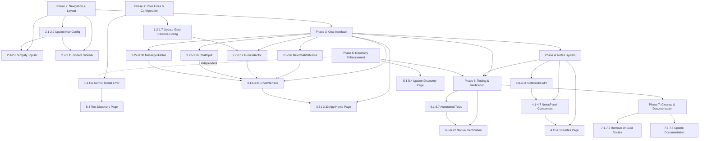
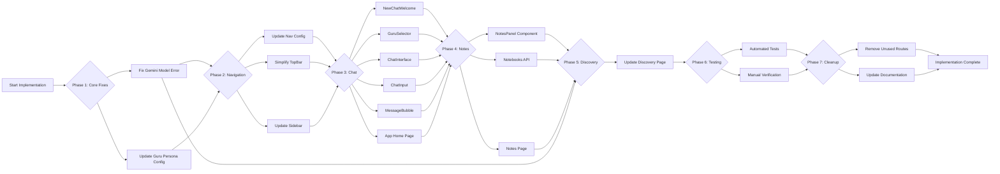

# Dashboard V1 Simplification - Dependency Graph & Execution Flow

## Visual Task Dependencies

## Execution Workflow

## Parallel Execution Opportunities

### Can Be Done in Parallel (Within Phases):

**Phase 1:**
- ✅ Fix Gemini Model Error (1.1)
- ✅ Update Guru Persona Config (1.2-1.7)

**Phase 2:**
- ✅ Update Nav Config (2.1-2.2)
- ✅ Simplify TopBar (2.3-2.6)
- ✅ Update Sidebar (2.7-2.11)

**Phase 3:**
- ✅ NewChatWelcome Component (3.1-3.6)
- ✅ GuruSelector Component (3.7-3.12)
- ✅ ChatInput Simplification (3.22-3.26)
- ✅ MessageBubble Updates (3.27-3.30)

**Phase 4:**
- ✅ NotesPanel Component (4.1-4.7)
- ✅ Notebooks API Updates (4.8-4.11)
- ✅ Notes Page (4.11-4.16)

**Phase 5:**
- ✅ Discovery Page Updates (5.1-5.4) - **Can start anytime after Phase 1**

**Phase 6:**
- ✅ Automated Tests (6.1-6.7)
- ✅ Manual Verification (6.6-6.22)

**Phase 7:**
- ✅ Remove Unused Routes (7.1-7.2)
- ✅ Update Documentation (7.3-7.8)

### Must Be Sequential (Critical Path):

1. **Phase 1** → **Phase 2** (Navigation config needed before UI)
2. **Phase 2** → **Phase 3** (Navigation structure needed for chat)
3. **Phase 3** → **Phase 4** (Chat structure needed for notes panel)
4. **Phase 3/4** → **Phase 6** (Features must exist before testing)
5. **Phase 6** → **Phase 7** (Must verify before cleanup)

## Agent Assignment Recommendations

### Agent 1: Configuration & API Specialist
**Focus:** Phase 1 (Core Fixes)

- Task 1.1: Fix Gemini Model Error
- Task 1.2-1.7: Update Guru Persona Configuration
- Task 4.8-4.11: Notebooks API Updates

**Skills Needed:**
- API configuration
- TypeScript interfaces
- System prompt engineering

---

### Agent 2: UI/Navigation Specialist
**Focus:** Phase 2 (Navigation & Layout)

- Task 2.1-2.2: Update Navigation Configuration
- Task 2.3-2.6: Simplify TopBar Component
- Task 2.7-2.11: Update Sidebar Component

**Skills Needed:**
- React components
- Navigation patterns
- Popover/dropdown components

---

### Agent 3: Chat Interface Specialist
**Focus:** Phase 3 (Chat Interface Overhaul)

- Task 3.1-3.6: Create NewChatWelcome Component
- Task 3.7-3.12: Create GuruSelector Component
- Task 3.13-3.21: Update ChatInterface Component
- Task 3.22-3.26: Simplify ChatInput Component
- Task 3.27-3.30: Update MessageBubble Component
- Task 3.31-3.32: Update App Home Page

**Skills Needed:**
- React state management
- Component composition
- Markdown rendering
- Streaming chat UI

---

### Agent 4: Notes System Specialist
**Focus:** Phase 4 (Notes System)

- Task 4.1-4.7: Create NotesPanel Component
- Task 4.11-4.16: Create Notes Page

**Skills Needed:**
- Rich text editors (@uiw/react-md-editor)
- Split-panel layouts
- CRUD operations

---

### Agent 5: Discovery & Cleanup Specialist
**Focus:** Phase 5 & 7 (Discovery + Cleanup)

- Task 5.1-5.4: Update Discovery Page
- Task 7.1-7.2: Remove Unused Routes
- Task 7.3-7.8: Update Documentation

**Skills Needed:**
- Grid layouts
- Code cleanup
- Documentation

---

### Agent 6: Testing Specialist
**Focus:** Phase 6 (Testing & Verification)

- Task 6.1-6.7: Update Automated Tests
- Task 6.6-6.22: Manual Browser Verification

**Skills Needed:**
- Jest/React Testing Library
- Manual testing procedures
- Bug reporting

---

## Risk Mitigation

### High Risk Areas:

1. **Guru Persona System (Phase 1)**
   - Risk: Master prompts don't produce expected persona behavior
   - Mitigation: Test each persona thoroughly before proceeding

2. **Chat Interface Integration (Phase 3)**
   - Risk: Breaking existing chat functionality
   - Mitigation: Keep backup of original code, test incrementally

3. **Notes Panel Split-Panel (Phase 4)**
   - Risk: Layout issues with resizable panels
   - Mitigation: Use proven split-panel library, test on multiple screen sizes

4. **API Changes (Phase 4)**
   - Risk: Breaking existing notebooks functionality
   - Mitigation: Make thread_id optional, maintain backward compatibility

### Rollback Strategy:

- Each phase should be committed separately
- Use feature branches for major changes
- Keep original code commented out initially for reference

---

## Success Metrics

| Metric | Target | How to Measure |
|--------|--------|----------------|
| Tasks Completed | 85/85 | Todo list tracking |
| Tests Passing | 100% | `npm test` |
| Manual Checks | 17/17 passed | Verification checklist |
| Console Errors | 0 | Browser DevTools |
| Model Errors | 0 | Discovery page test |
| Persona Accuracy | 4/4 | Manual chat testing |

---

## Quick Reference for Agents

### Before Starting Any Task:
1. ✅ Read the existing file(s) you'll be modifying
2. ✅ Understand the current implementation
3. ✅ Check for related components that might be affected

### While Working:
1. ✅ Make surgical changes using `apply_diff`
2. ✅ Follow existing code patterns and style
3. ✅ Test incrementally after each change

### After Completing a Task:
1. ✅ Verify the change works as expected
2. ✅ Check for console errors
3. ✅ Update the todo list status
4. ✅ Document any issues or edge cases found

### When Blocked:
1. ✅ Check if dependencies are complete
2. ✅ Review the implementation plan for context
3. ✅ Ask clarifying questions if needed
