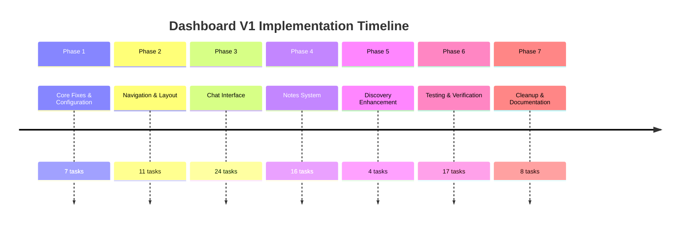

# Dashboard V1 Simplification - Implementation Summary

## Overview

This implementation plan has been broken down from a high-level concept into **85 specific, actionable tasks** organized across **7 phases**. The goal is to simplify the Shastrarthi dashboard with chat as the central experience.

---

## Documents Created

| Document | Purpose | Location |
|----------|---------|----------|
| **Task Breakdown** | Detailed 85-task breakdown with specifications | [`dashboard-v1-simplification-breakdown.md`](dashboard-v1-simplification-breakdown.md:1) |
| **Dependency Graph** | Visual task dependencies and execution flow | [`dashboard-v1-dependency-graph.md`](dashboard-v1-dependency-graph.md:1) |
| **Agent Quickstart** | Quick reference guide for agents | [`dashboard-v1-agent-quickstart.md`](dashboard-v1-agent-quickstart.md:1) |
| **This Summary** | High-level overview | [`dashboard-v1-implementation-summary.md`](dashboard-v1-implementation-summary.md:1) |

---

## Phases at a Glance



---

## Task Distribution by Phase

| Phase | Name | Tasks | Complexity | Dependencies |
|-------|------|-------|------------|--------------|
| 1 | Core Fixes & Configuration | 7 | Medium | None |
| 2 | Navigation & Layout | 11 | Low-Medium | Phase 1 |
| 3 | Chat Interface | 24 | High | Phase 1, 2 |
| 4 | Notes System | 16 | High | Phase 1, 3 |
| 5 | Discovery Enhancement | 4 | Low | Phase 1 |
| 6 | Testing & Verification | 17 | Medium | Phases 1-5 |
| 7 | Cleanup & Documentation | 8 | Low | Phase 6 |
| **Total** | | **85** | | |

---

## Key Features to Implement

### 1. Chat as Central Experience
- Replace dashboard with chat interface on home page
- Script.io-style welcome with 6 use-case cards
- Clean, minimal chat input

### 2. Guru Persona System
- 4 configurable personas: Swami Vivekananda, Shri Krishna, Ramana Maharshi, Abhinavagupta
- Master prompts for each persona
- Dropdown selector in chat header

### 3. Notes Side Panel
- Left-side split-panel with rich markdown editor
- Thread-linked notes
- Standalone "My Notes" page

### 4. Simplified Navigation
- Reduced to 5 items: Home, My Notes, My Library, Shastra Discovery, Ancient History
- Account menu in sidebar footer
- Clean TopBar (breadcrumb + pricing only)

### 5. Enhanced Discovery
- Renamed to "Shastra Discovery"
- Topics grid below search bar

---

## Agent Assignment Strategy

### Recommended Agent Specializations

| Agent | Focus | Phases | Tasks |
|-------|-------|--------|-------|
| **Config & API Specialist** | Configuration, API routes | 1, 4 (partial) | 10 |
| **UI/Navigation Specialist** | Navigation, layout components | 2 | 11 |
| **Chat Interface Specialist** | Chat components, streaming | 3 | 24 |
| **Notes System Specialist** | Notes panel, editor | 4 | 16 |
| **Discovery & Cleanup** | Discovery page, cleanup | 5, 7 | 12 |
| **Testing Specialist** | Tests, verification | 6 | 17 |

---

## Critical Path

The following sequence must be followed:

```
Phase 1 (Core Fixes)
    ↓
Phase 2 (Navigation)
    ↓
Phase 3 (Chat Interface)
    ↓
Phase 4 (Notes System)
    ↓
Phase 6 (Testing)
    ↓
Phase 7 (Cleanup)
```

**Phase 5 (Discovery)** can be done in parallel after Phase 1.

---

## Parallel Execution Opportunities

### Within Phase 1:
- ✅ Fix Gemini Model Error
- ✅ Update Guru Persona Configuration

### Within Phase 2:
- ✅ Update Nav Config
- ✅ Simplify TopBar
- ✅ Update Sidebar

### Within Phase 3:
- ✅ NewChatWelcome Component
- ✅ GuruSelector Component
- ✅ ChatInput Simplification
- ✅ MessageBubble Updates

### Within Phase 4:
- ✅ NotesPanel Component
- ✅ Notebooks API Updates
- ✅ Notes Page

---

## New Components to Create

| Component | Purpose | Location |
|-----------|---------|----------|
| `NewChatWelcome.tsx` | Welcome screen with use-case cards | [`shastrarthi/components/chat/NewChatWelcome.tsx`](shastrarthi/components/chat/NewChatWelcome.tsx:1) |
| `GuruSelector.tsx` | Persona dropdown selector | [`shastrarthi/components/chat/GuruSelector.tsx`](shastrarthi/components/chat/GuruSelector.tsx:1) |
| `NotesPanel.tsx` | Notes side panel with editor | [`shastrarthi/components/chat/NotesPanel.tsx`](shastrarthi/components/chat/NotesPanel.tsx:1) |
| `app/notes/page.tsx` | Standalone notes page | [`shastrarthi/app/(app)/app/notes/page.tsx`](shastrarthi/app/(app)/app/notes/page.tsx:1) |

---

## Dependencies to Install

```bash
cd shastrarthi

# For markdown rendering in chat
npm install react-markdown remark-gfm

# For rich markdown editor in notes
npm install @uiw/react-md-editor
```

---

## Success Criteria

| Metric | Target | Measurement |
|--------|--------|-------------|
| Tasks Completed | 85/85 | Todo list |
| Tests Passing | 100% | `npm test` |
| Manual Checks | 17/17 | Verification checklist |
| Console Errors | 0 | Browser DevTools |
| Model Errors | 0 | Discovery page |
| Persona Accuracy | 4/4 | Manual testing |

---

## Risk Assessment

### High Risk Areas

| Risk | Impact | Mitigation |
|------|--------|------------|
| Guru persona prompts don't work | Medium | Test each persona thoroughly |
| Chat interface breaks | High | Keep backups, test incrementally |
| Notes panel layout issues | Medium | Use proven library, test responsive |
| API changes break existing | Medium | Make thread_id optional |

---

## How to Use These Documents

### For Project Managers:
1. Read this **Summary** for overview
2. Review **Dependency Graph** for timeline planning
3. Use **Task Breakdown** for progress tracking

### For Agents:
1. Read **Agent Quickstart** first
2. Find your phase in **Task Breakdown**
3. Check **Dependency Graph** for prerequisites
4. Follow task specifications step by step

---

## Quick Start for Implementation

### Step 1: Assign Phases to Agents
- Review the agent assignment strategy above
- Assign phases based on agent expertise
- Ensure dependencies are respected

### Step 2: Agents Begin Work
- Each agent reads their phase in the Task Breakdown
- Agents check dependencies in Dependency Graph
- Agents reference Agent Quickstart for guidance

### Step 3: Track Progress
- Update todo list as tasks complete
- Run tests after each phase
- Verify functionality manually

### Step 4: Final Verification
- Complete Phase 6 (Testing)
- Run full test suite
- Complete all manual verification items
- Complete Phase 7 (Cleanup)

---

## File Structure Impact

### Files to Modify:
- `shastrarthi/lib/learnlm.ts`
- `shastrarthi/lib/config/prompts.ts`
- `shastrarthi/lib/config/nav.ts`
- `shastrarthi/components/app/Sidebar.tsx`
- `shastrarthi/components/app/TopBar.tsx`
- `shastrarthi/components/chat/ChatInterface.tsx`
- `shastrarthi/components/chat/ChatInput.tsx`
- `shastrarthi/components/chat/MessageBubble.tsx`
- `shastrarthi/app/api/chat/route.ts`
- `shastrarthi/app/api/notebooks/route.ts`
- `shastrarthi/app/api/notebooks/[id]/route.ts`
- `shastrarthi/app/(app)/app/page.tsx`
- `shastrarthi/app/(app)/app/discover/page.tsx`

### Files to Create:
- `shastrarthi/components/chat/NewChatWelcome.tsx`
- `shastrarthi/components/chat/GuruSelector.tsx`
- `shastrarthi/components/chat/NotesPanel.tsx`
- `shastrarthi/app/(app)/app/notes/page.tsx`

---

## Next Steps

1. **Review the plan** - Read through all documents
2. **Ask questions** - Clarify any ambiguities
3. **Assign agents** - Allocate phases to appropriate agents
4. **Begin Phase 1** - Start with core fixes and configuration
5. **Track progress** - Update todo list as work progresses

---

## Questions?

If you have questions about:
- **Task specifications** → See [`dashboard-v1-simplification-breakdown.md`](dashboard-v1-simplification-breakdown.md:1)
- **Dependencies** → See [`dashboard-v1-dependency-graph.md`](dashboard-v1-dependency-graph.md:1)
- **Getting started** → See [`dashboard-v1-agent-quickstart.md`](dashboard-v1-agent-quickstart.md:1)
- **Overall plan** → Review this summary

---

## Document Index

1. [`dashboard-v1-simplification-breakdown.md`](dashboard-v1-simplification-breakdown.md:1) - 85 detailed tasks with specifications
2. [`dashboard-v1-dependency-graph.md`](dashboard-v1-dependency-graph.md:1) - Visual dependencies and execution flow
3. [`dashboard-v1-agent-quickstart.md`](dashboard-v1-agent-quickstart.md:1) - Agent quick reference guide
4. [`dashboard-v1-implementation-summary.md`](dashboard-v1-implementation-summary.md:1) - This overview document
