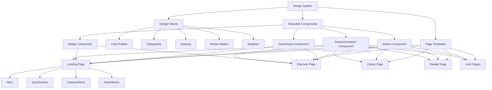

# Design Consistency Plan - Shastrarthi

## Overview
This plan documents the design system specifications from the home page and outlines how to apply consistent styling across all sections of Shastrarthi.

## Design System Specifications

### 1. Layout & Alignment
- **Structure**: Single-column, vertically stacked layout
- **Alignment**: All elements centered horizontally (`text-center`, `flex-col`, `items-center`)
- **Spacing**:
  - ~80px top padding for main sections
  - ~24px gap between badge and heading
  - ~16px gap between heading and subheading
  - ~40px gap between subheading and search bar
  - ~12px gap between search bar and helper text
  - ~40px gap between helper text and action buttons
  - ~48px gap between buttons and feature indicators
  - Generous vertical whitespace between sections

### 2. Color Scheme

#### Background
- **Primary**: Soft, warm gradient overlay
  - Radial/angular gradient from white/cream (top-left) to soft peach/orange (bottom-right and top-right)
  - Implementation: `bg-gradient-to-br from-white/cream to-peach/orange`

#### Text Colors
- **Primary Text**: Dark Charcoal / Warm Gray (`#1F2937` or `text-gray-900`)
- **Secondary Text**: Medium Gray / Brownish-Gray (`#4B5563` or `text-gray-600`)

#### Accent Colors (Orange)
- **Solid Orange**: `#EA580C` or `bg-orange-600` (primary button, search button)
- **Light Peach/Orange**: `#FFEDD5` or `bg-orange-100` (secondary button background)
- **Sparkle Icon**: `text-orange-500`

#### Status Dots
- Green: `bg-green-500`
- Blue: `bg-blue-500`
- Purple: `bg-purple-500`

### 3. Typography

#### Headings
- **Font Family**: Serif (Merriweather, Newsreader, or Playfair Display)
- **Weight**: Bold or ExtraBold (`font-bold` / 700)
- **Size**: Large, roughly `text-5xl` or `text-6xl` (48px-60px)
- **Color**: `text-gray-900`

#### Subheadings
- **Font Family**: Sans-serif (Inter, Roboto, or system sans)
- **Weight**: Regular (`font-normal`)
- **Size**: `text-lg` or `text-xl`
- **Line Height**: Relaxed (`leading-relaxed`)
- **Color**: `text-gray-600`

#### UI Elements (Buttons/Search/Badge)
- **Font Family**: Sans-serif
- **Size**: `text-sm` or `text-base`
- **Weight**: `font-medium` on buttons

### 4. Components

#### A. Top Badge (Pill)
- **Shape**: Fully rounded pill (`rounded-full`)
- **Background**: White (`bg-white`)
- **Border/Shadow**: Subtle border (`border border-gray-100`) + soft shadow (`shadow-sm`)
- **Content**:
  - Icon: Sparkles (✨) in orange (`text-orange-500`)
  - Text: "AI-Powered Ancient Wisdom" in dark gray sans-serif

#### B. Search Bar
- **Container**:
  - Width: `max-w-2xl` (672px)
  - Height: `h-16` (64px)
  - Background: White (`bg-white`)
  - Border Radius: `rounded-2xl` (16px)
  - Shadow: Deep, soft drop shadow (`shadow-xl` or `shadow-lg`)
  - Border: Thin, subtle gray (`border border-gray-200`)
- **Elements Inside**:
  - Left Icon: Magnifying glass, gray (`text-gray-400`), padding-left ~20px
  - Input: Placeholder text "Search texts, concepts, verses...", gray (`text-gray-400`)
  - Right Button: "Search", Solid Orange (`bg-orange-600 hover:bg-orange-700`), White text, `rounded-xl`, padding `px-6 py-2.5`

#### C. Helper Text
- **Placement**: Directly below search bar
- **Content**: "Try: 'Bhagavad Gita', 'Karma Yoga', 'Dharma', 'Meditation'"
- **Style**: `text-sm`, `text-gray-500`, centered

#### D. Call-to-Action Buttons
- **Layout**: Flex row, centered, gap `gap-4` (16px)
- **Primary Button (Left)**: "Browse Texts"
  - Solid Orange (`bg-orange-600`)
  - White text
  - `rounded-lg`
  - Bold font
  - Shadow: `shadow-md` or `shadow-orange/20`
- **Secondary Button (Right)**: "Get Started Free"
  - Light Orange/Peach tint (`bg-orange-100` or `bg-opacity-20`)
  - Orange text (`text-orange-700`)
  - Orange border (`border border-orange-200/50`)
  - Glassmorphism feel

#### E. Footer Features
- **Layout**: Flex row, centered, gap `gap-6` (24px)
- **Items**:
  - Green Dot + "10+ Sacred Texts"
  - Blue Dot + "AI Explanations"
  - Purple Dot + "Save & Organize"
- **Text Style**: `text-sm`, `text-gray-600`, sans-serif `font-medium`

### 5. Summary of Effects
- **Gradients**: Warm, diffuse "glow" effect in background
- **Shadows**: Search bar has most prominent shadow (`shadow-xl`), Badge and Primary Button have softer shadows (`shadow-sm`, `shadow-md`)
- **Roundedness**: Heavy use of rounded corners - `rounded-full` for badge/dots, `rounded-2xl` for search, `rounded-lg` for buttons

---

## Implementation Plan

### Phase 1: Design Token Updates
1. Update [`tailwind.config.ts`](../shastrarthi/tailwind.config.ts) with:
   - Orange accent colors (#EA580C, #FFEDD5)
   - Serif font family configuration
   - Custom spacing values
   - Warm gradient utilities

### Phase 2: Reusable Component Creation
Create new components in `components/ui/` directory:

1. **Button Component** (`components/ui/Button.tsx`)
   - Primary variant (solid orange)
   - Secondary variant (light orange with border)
   - Consistent sizing and spacing

2. **SearchInput Component** (`components/ui/SearchInput.tsx`)
   - Large, prominent search bar
   - Icon placement
   - Search button integration
   - Consistent shadow and border

3. **Badge Component** (`components/ui/Badge.tsx`)
   - Pill-shaped badge
   - Icon + text layout
   - Consistent styling

4. **SectionContainer Component** (`components/ui/SectionContainer.tsx`)
   - Consistent padding and spacing
   - Center alignment utilities
   - Background gradient support

### Phase 3: Page Updates

#### Landing Page (`app/page.tsx`)
1. **Hero Section** ([`components/landing/Hero.tsx`](../shastrarthi/components/landing/Hero.tsx))
   - Apply exact spacing values
   - Update colors to match spec
   - Ensure serif typography for heading

2. **QuickIntents Section** ([`components/landing/QuickIntents.tsx`](../shastrarthi/components/landing/QuickIntents.tsx))
   - Apply consistent spacing
   - Update card styling with rounded corners
   - Use new Button component

3. **FeaturedTexts Section** ([`components/landing/FeaturedTexts.tsx`](../shastrarthi/components/landing/FeaturedTexts.tsx))
   - Apply consistent spacing
   - Update card styling
   - Use new Button component

4. **HowItWorks Section** ([`components/landing/HowItWorks.tsx`](../shastrarthi/components/landing/HowItWorks.tsx))
   - Apply consistent spacing
   - Update card styling
   - Ensure consistent icon sizing

#### Discover Page (`app/discover/page.tsx`)
1. Update header section with consistent styling
2. Update [`components/discover/SearchBar.tsx`](../shastrarthi/components/discover/SearchBar.tsx) to match hero search bar
3. Update [`components/discover/TextCard.tsx`](../shastrarthi/components/discover/TextCard.tsx) with consistent styling
4. Update [`components/discover/FilterBar.tsx`](../shastrarthi/components/discover/FilterBar.tsx) with consistent styling

#### Library Page (`app/library/page.tsx`)
1. Update header section with consistent styling
2. Update library component cards with consistent styling
3. Apply consistent spacing

#### Lists Page (`app/lists/page.tsx`)
1. Apply consistent header styling
2. Use consistent spacing and colors

#### Reader Page (`app/reader/[slug]/page.tsx`)
1. Update header section with consistent styling
2. Update reader components with consistent styling
3. Apply consistent spacing

#### Auth Pages (`app/auth/login/page.tsx`, `app/auth/signup/page.tsx`)
1. Update [`components/auth/AuthForm.tsx`](../shastrarthi/components/auth/AuthForm.tsx) with consistent styling
2. Use new Button component
3. Apply consistent spacing

---

## Design Tokens Reference

### Color Palette
```css
/* Orange Accent Colors */
--orange-100: #FFEDD5;  /* Light peach for secondary backgrounds */
--orange-500: #F97316;  /* Medium orange for icons */
--orange-600: #EA580C;  /* Primary orange for buttons */
--orange-700: #C2410C;  /* Darker orange for hover states */

/* Text Colors */
--gray-400: #9CA3AF;   /* Placeholder text */
--gray-500: #6B7280;   /* Helper text */
--gray-600: #4B5563;   /* Secondary text */
--gray-900: #111827;   /* Primary text */

/* Status Dots */
--green-500: #22C55E;
--blue-500: #3B82F6;
--purple-500: #A855F7;
```

### Spacing
```css
/* Section spacing */
--section-padding-top: 80px;
--gap-badge-heading: 24px;
--gap-heading-subheading: 16px;
--gap-subheading-search: 40px;
--gap-search-helper: 12px;
--gap-helper-buttons: 40px;
--gap-buttons-features: 48px;
```

### Border Radius
```css
--radius-full: 9999px;   /* Badge, dots */
--radius-2xl: 16px;      /* Search bar */
--radius-xl: 12px;       /* Search button */
--radius-lg: 8px;        /* Buttons, cards */
```

### Shadows
```css
--shadow-sm: 0 1px 2px 0 rgb(0 0 0 / 0.05);           /* Badge */
--shadow-md: 0 4px 6px -1px rgb(0 0 0 / 0.1);        /* Buttons */
--shadow-lg: 0 10px 15px -3px rgb(0 0 0 / 0.1);      /* Cards */
--shadow-xl: 0 20px 25px -5px rgb(0 0 0 / 0.1);      /* Search bar */
```

---

## Architecture Diagram



---

## Component Usage Examples

### Button Component
```tsx
<Button variant="primary">Browse Texts</Button>
<Button variant="secondary">Get Started Free</Button>
```

### SearchInput Component
```tsx
<SearchInput 
  placeholder="Search texts, concepts, verses..."
  helperText="Try: 'Bhagavad Gita', 'Karma Yoga', 'Dharma', 'Meditation'"
/>
```

### Badge Component
```tsx
<Badge icon={<Sparkles />}>AI-Powered Ancient Wisdom</Badge>
```

### SectionContainer Component
```tsx
<SectionContainer>
  <h1 className="text-5xl font-bold font-serif">Section Title</h1>
  <p className="text-lg text-gray-600">Section description</p>
</SectionContainer>
```

---

## Notes
- All pages should maintain the warm gradient background feel
- Serif typography should be used for all main headings
- Orange accent color (#EA580C) should be the primary action color
- Consistent spacing is critical for the clean, uncluttered feel
- All interactive elements should have appropriate hover states
- Dark mode support should be maintained throughout
