# Landing Page Redesign Plan

## Current State Analysis

### Existing Components
- **Hero Section** ([`Hero.tsx`](shastra-platform/components/landing/Hero.tsx)): Headline, description, 2 CTAs (Browse Texts, Get Started)
- **HowItWorks Section** ([`HowItWorks.tsx`](shastra-platform/components/landing/HowItWorks.tsx)): 4 steps with icons (Discover, Read & Learn, Ask AI, Save & Organize)

### Missing Elements (User Requirements)
1. No chat or action for users to perform while on the landing page
2. No references/texts with icons/links that redirect to specific flows
3. No quick actionable items for users who don't know what they want to do
4. Goal: Give users every possible intent and action to perform from the get-go

---

## Proposed Landing Page Structure

### Section 1: Hero Section (Enhanced)
**Location:** Top of page
**Purpose:** Immediate engagement with search and quick actions

**New Elements:**
- Search bar for instant text discovery (redirects to `/discover` with search query)
- Featured "Verse of the Day" with quick AI explanation preview
- Primary CTAs: "Browse Texts", "Get Started"
- Secondary CTAs: "Explore by Category", "Ask AI Anything"

---

### Section 2: Quick Intents / User Goals
**Purpose:** Help users who don't know what they want to do

**Intent Cards:**
| Intent | Icon | Description | Action |
|--------|------|-------------|--------|
| "I want to learn about..." | `Lightbulb` | Philosophy, concepts, teachings | → `/discover` with pre-filter |
| "I'm looking for..." | `Search` | Specific texts, topics | → `/discover` with search focus |
| "I want to explore..." | `Compass` | Categories, traditions | → `/discover` with category filter |
| "I want to practice..." | `Activity` | Yoga, meditation techniques | → Yoga texts in `/discover` |

---

### Section 3: Featured Texts Showcase
**Purpose:** Direct access to popular texts with visual appeal

**Layout:** Grid of 4-6 text cards

**Card Structure:**
- Text icon (category-specific)
- Title (English + Sanskrit)
- Short description
- Category badge
- Difficulty badge
- "Start Reading" button → `/reader/[slug]`
- "Learn More" link → `/discover`

**Featured Texts:**
1. Bhagavad Gita - Chapter 2 (Itihasa, Beginner)
2. Yoga Sutras of Patanjali (Yoga, Intermediate)
3. Mandukya Upanishad (Upanishads, Advanced)
4. Isha Upanishad (Upanishads, Beginner)
5. Hatha Yoga Pradipika (Yoga, Intermediate)
6. Vivekachudamani (Vedanta, Advanced)

---

### Section 4: Browse by Category
**Purpose:** Quick navigation to text categories

**Category Cards:**
| Category | Icon | Description | Text Count | Action |
|----------|------|-------------|------------|--------|
| Vedas | `Scroll` | Ancient sacred scriptures | X texts | → `/discover?category=Vedas` |
| Upanishads | `BookOpen` | Philosophical texts | X texts | → `/discover?category=Upanishads` |
| Yoga | `Activity` | Yoga philosophy & practice | X texts | → `/discover?category=Yoga` |
| Itihasa | `History` | Epic narratives | X texts | → `/discover?category=Itihasa` |
| Tantra | `Sparkles` | Tantric texts | X texts | → `/discover?category=Tantra` |
| Vedanta | `Brain` | Non-dual philosophy | X texts | → `/discover?category=Vedanta` |

---

### Section 5: Quick AI Chat Widget
**Purpose:** Instant AI interaction without leaving landing page

**Features:**
- Simple chat input field
- Pre-built quick prompts:
  - "What is the Bhagavad Gita about?"
  - "Explain the concept of Dharma"
  - "What are the Yoga Sutras?"
  - "Tell me about Karma Yoga"
- On submit: Redirects to relevant text reader or creates a new chat session

**Fallback:** If not authenticated → prompt to sign up first

---

### Section 6: How It Works (Enhanced)
**Purpose:** Explain the platform with actionable steps

**Enhancements:**
- Add direct action buttons to each step
- Make cards more interactive with hover effects
- Add "Try it now" links

---

### Section 7: Difficulty Levels
**Purpose:** Help users choose texts based on their level

**Difficulty Cards:**
| Level | Icon | Description | Example Texts | Action |
|-------|------|-------------|---------------|--------|
| Beginner | `Seedling` | Perfect for newcomers | Isha Upanishad, BG Ch. 2 | → `/discover?difficulty=beginner` |
| Intermediate | `TrendingUp` | Some prior knowledge | Yoga Sutras, Hatha Yoga | → `/discover?difficulty=intermediate` |
| Advanced | `Award` | Deep philosophical study | Mandukya Upanishad | → `/discover?difficulty=advanced` |

---

### Section 8: CTA / Sign Up Section
**Purpose:** Final conversion point

**Content:**
- "Ready to begin your journey?"
- Sign up form or button
- Benefits list:
  - Save your favorite texts
  - Take notes on verses
  - Ask unlimited questions
  - Build your personal library

---

## New Components to Create

### 1. `SearchBar.tsx` (Landing Page Version)
- Search input with icon
- On submit: redirects to `/discover?search=`
- Placeholder: "Search texts, concepts, verses..."

### 2. `QuickIntents.tsx`
- Grid of intent cards
- Each card has icon, title, description, and action button
- Links to appropriate discover filters

### 3. `FeaturedTexts.tsx`
- Grid of featured text cards
- Fetches texts from database or uses static data
- Each card links to `/reader/[slug]`

### 4. `CategoryCards.tsx`
- Grid of category cards with icons
- Each card links to `/discover?category=`

### 5. `QuickChatWidget.tsx`
- Chat input with pre-built prompts
- Handles submission and redirects

### 6. `DifficultyCards.tsx`
- Grid of difficulty level cards
- Each card links to `/discover?difficulty=`

### 7. `CTASection.tsx`
- Final sign-up CTA with benefits list

### 8. `LandingNav.tsx` (Optional)
- Navigation header for landing page
- Links to: Home, Discover, Library, Login/Signup

---

## Updated Page Structure

```mermaid
graph TD
    A[Landing Page] --> B[Hero Section]
    A --> C[Quick Intents]
    A --> D[Featured Texts]
    A --> E[Browse by Category]
    A --> F[Quick AI Chat Widget]
    A --> G[How It Works Enhanced]
    A --> H[Difficulty Levels]
    A --> I[CTA Section]
    
    B --> B1[Search Bar]
    B --> B2[Verse of the Day]
    B --> B3[Primary CTAs]
    
    C --> C1[Learn About]
    C --> C2[Looking For]
    C --> C3[Explore]
    C --> C4[Practice]
    
    D --> D1[Bhagavad Gita]
    D --> D2[Yoga Sutras]
    D --> D3[Mandukya Upanishad]
    D --> D4[Isha Upanishad]
    D --> D5[Hatha Yoga Pradipika]
    D --> D6[Vivekachudamani]
    
    E --> E1[Vedas]
    E --> E2[Upanishads]
    E --> E3[Yoga]
    E --> E4[Itihasa]
    E --> E5[Tantra]
    E --> E6[Vedanta]
    
    F --> F1[Chat Input]
    F --> F2[Quick Prompts]
    
    G --> G1[Discover Texts]
    G --> G2[Read and Learn]
    G --> G3[Ask AI]
    G --> G4[Save and Organize]
    
    H --> H1[Beginner]
    H --> H2[Intermediate]
    H --> H3[Advanced]
    
    I --> I1[Sign Up CTA]
    I --> I2[Benefits List]
```



---

## File Structure

```
shastra-platform/
├── app/
│   └── page.tsx (updated with new sections)
├── components/
│   └── landing/
│       ├── Hero.tsx (enhanced)
│       ├── HowItWorks.tsx (enhanced)
│       ├── SearchBar.tsx (new)
│       ├── QuickIntents.tsx (new)
│       ├── FeaturedTexts.tsx (new)
│       ├── CategoryCards.tsx (new)
│       ├── QuickChatWidget.tsx (new)
│       ├── DifficultyCards.tsx (new)
│       ├── CTASection.tsx (new)
│       └── LandingNav.tsx (new, optional)
```

---

## Design Considerations

### Color Scheme
- Primary: `saffron-600` (CTAs, highlights)
- Background: Gradient from `sand-50` → `ochre-50` → `saffron-600`
- Cards: White with `sand-200` borders
- Dark mode: `sand-800` backgrounds, `sand-700` borders

### Icons
Use `lucide-react` icons consistently:
- `Lightbulb` - Learning/ideas
- `Search` - Search/discovery
- `Compass` - Exploration
- `Activity` - Practice/action
- `BookOpen` - Reading/texts
- `Scroll` - Vedas
- `Sparkles` - Tantra/insights
- `Brain` - Philosophy
- `History` - Itihasa
- `Seedling` - Beginner
- `TrendingUp` - Intermediate
- `Award` - Advanced

### Responsive Design
- Mobile: 1 column layout
- Tablet: 2 columns
- Desktop: 3-4 columns

---

## Implementation Priority

1. **Phase 1: Core Sections**
   - Enhanced Hero with search bar
   - Quick Intents section
   - Featured Texts section

2. **Phase 2: Navigation & Discovery**
   - Category Cards section
   - Difficulty Cards section

3. **Phase 3: Interactive Elements**
   - Quick AI Chat Widget
   - Enhanced HowItWorks with action links

4. **Phase 4: Conversion**
   - CTA Section
   - Landing Navigation (if needed)

---

## Success Metrics

1. User engagement: Time on page, scroll depth
2. Click-through rates to `/discover` and `/reader`
3. Sign-up conversions from landing page
4. Search bar usage rate
5. Quick chat widget usage rate
